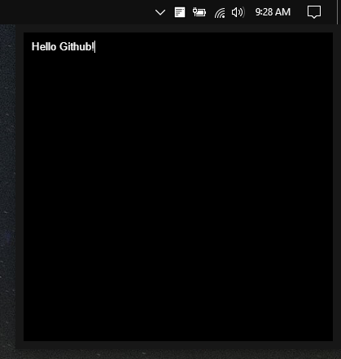

# NoteTray

Copyright © 2019 Gabriel Polastrini

Create notes from your system tray.

### Dark Mode

### Light Mode

## Usage

<kbd>Ctrl</kbd> + <kbd>Alt</kbd> + <kbd>N</kbd> Show NoteTray Window.

<kbd>Ctrl</kbd> + <kbd>Q</kbd> Quit app.
