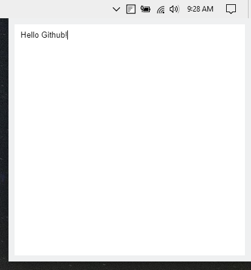

# NoteTray

Copyright © 2019 Gabriel Polastrini

Create notes from your system tray.

### Dark Mode


### Light Mode


## Download & Install

Download the latest version from the [Releases Page](https://github.com/r00tgp/NoteTray/releases).
Extract the ```notetray-win32-x64.zip``` file and execute the ```notetray.exe``` file!

## Usage

<kbd>Ctrl</kbd> + <kbd>Alt</kbd> + <kbd>N</kbd> Show NoteTray Window.

<kbd>Ctrl</kbd> + <kbd>Q</kbd> Quit app.

## Credits

NoteTray was created by [Gabriel Polastrini](https://gabrielpolastrini.com). Released under the GPL v3 license.
